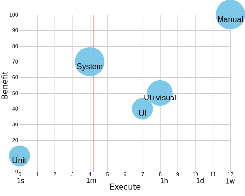

## Testing

Overview of software testing  
concepts and practises.

> Ivo Maixner  
> ivo.maixner@gmail.com

^^^^

## Contents

- The meaning of tests
- Types of tests
- Testing strategy

^^^^

- Angry calls from customers
- Urgent bug fix at 2 am.
- Customer churn
- Weekend shifts
- Bug-fixing > new features
- Closed modules not to be touched
- Code owned by single person
- Unknown system functionality

^^

## Why test?

- To make sure the application works

> We do tests to retain our sanity,  
have peace of mind and sleep well at night.

^^^^

<!-- .slide: data-transition="fade" -->

## The meaning of tests

- Tests pass &Implies; No bugs
- <!-- .element: style="color: white;" -->
- Tests exist & run, coverage &Implies; SW quality

^^

## The meaning of tests

<!-- .slide: data-transition="fade" -->

- ~~Tests pass &Implies; No bugs~~
- <!-- .element: style="color: white;" -->
- Tests exist & run, coverage &Implies; SW quality

^^

<!-- .slide: data-transition="fade" -->

## The meaning of tests

- ~~Tests pass &Implies; No bugs~~
- Tests fail &Implies; Maybe bug
- Tests exist & run, coverage &Implies; SW quality

^^

<!-- .slide: data-transition="fade" -->

## The meaning of tests

- ~~Tests pass &Implies; No bugs~~
- Tests fail &Implies; Maybe bug
- ~~Tests exist & run, coverage &Implies; SW quality~~

^^

## SW quality

- Product owner
- Development team
- Process
- System design choices
- UX
- etc.

Notes:
- SW quality results from many factors.
- E.g. owner: requirements concise, consistent, prioritized.
- Design choices: Thousands of decisions, each one important,  
  may cause the app quality to deteriorate.
- SW quality is never guaranteed,  
  it is a happy coincidence of all the stars being aligned.

^^^^

## Test-driven development

- Write test before implementation
- See it fail then pass
- Bug &Implies; first task: write test that exposes it
- Alternative: split FSD into test & impl

Notes:
- Fail then pass: Verifies test is able to fail
- Bug: test = regression, make sure the bug will never return
- Split: 1 dev writes test, other dev writes impl  
  Finally it should match, or implies issue with FSD

^^^^

## Ideal test

1. Setup the whole system state
2. Execute the exact sequence of steps
3. Verify the whole system responses
4. Verify the whole system state

Notes:
- State: DB, filesystem, message queues and topics, cache, other in-memory data
- Sequence: order of steps, exact timing
- Steps: input data

^^

## False positive

> Test fails, but no issue.

- System state setup partially,  
  or varying sequence of steps
- Flaky, non-deterministic tests
- &Implies; Fix or delete

^^

## False negative

> Test passes, but app not working.

- Not verifying whole system state  
  or responses
- Not seen fail then pass
- Undetected until bug reported from  
  other test (type) or users (!!)

Notes:
- (Ineffective test)
- Always try hard to prevent false negatives!
	- Process: fail then pass
	- Tool: verify (close to) whole response and state

^^

## Test passes

- Given a subset of system state (**specific!**, partial)
- When we perform a system functionality (**specific!**)
- Then system response contains (partial)
- And system state contains (**partial!**)

Notes:
- Specific:
	- What about other initial states?
	- What about other input data?
	- &Implies; Vast space of cases un-tested!
	- Extrapolation has its definite limits
		- Generally impossible to conceive upfront

^^^^

## Manual tests
#### How to

> Test Analyst writes test scenarios to verify app fulfills FSD.  
> Human testers then manually exercise them.

- Formal scenario template
- Single explicit sequence of steps
- Test data included or recorded
- Test run documentation: scenarios, issues
- Test categories: Smoke, Core, Extensive

Notes:
- Categories: Conserve your energy.
	- Smoke: Is it worth testing? - App starts, single user task.
	- Core: Can it be used? - All user goals can be achieved, even with workarounds.
	- Extensive: All functionality, validations, error handling.

^^

## Manual tests
#### Properties

- Test Analyst required
- Execution time consuming &Implies; $$$ + not CD-friendly
- Covers UX &Implies; Indispensable

Notes:
- Continuous Deployment: cannot be automatic, manual step in the middle.
- THE only way to ensure proper UX

^^

## Manual tests
#### Best fit

- UX-sensitive apps or features
- Overall workflow, feature sequence
- Features not suitable for automation

Notes:
- Not automated: Example: animations.

^^

## Manual tests
#### Common anti-patterns

- No FSD
- Absence of test scenarios
- Missing conclusive test run documentation

Notes:
- No FSD: Testers report imaginary "errors".  
  Every tester has an opinion. Never-ending changes.

^^

## Manual tests

Doing manual tests is drudgery.

^^^^

## UI functional tests
#### How to

> Tester writes a script that drives the UI of the application
> and verifies its output on the UI level.

- Setup DB before each test
- Select elements by label

Notes:
- Try to isolate tests.
- DB:
	- Setup DB
		- Before each test specifically for the test (how?)
		- Before each test with a single, reused dataset (how?)
		- Once before all tests: tests inter-dependent, big no-no
	- Verify DB
		- After each test (how?)
		- Through UI: test result depends on app UI (?!)
- CSS selectors:
	- use existing ids & classes: might change & break tests
	- introduce test-specific ones: have to be maintained in production code
	- go with labels: preferred: user's perspective, but single locale tested

^^

## UI functional tests
#### Properties

- Asynchronicity &Implies; Complexity
- Dependence on details &Implies; Fragility
- No appearance or UX &Implies; Other tests needed
- I have yet to see an enjoyable testing tool

Notes:

- Async: test has to wait, tool must wait automatically,  
  otherwise explicit synchronization = nightmare
- Details: CSS selectors
- Verifying multiple data values on page: not suitable, e.g. table

^^

## UI functional tests
#### Best fit

- Finished features, regression
- Light-weight: successful variants only

^^

## UI functional tests
#### Common anti-patterns

- DB reused, DB setup reused

Notes:
- DB setup reuse: Single setup dataset shared between tests.
- DB reuse: DB setup run once, tests inter-dependent, big no-no.

^^

## UI functional tests

Metaphor: umbrella

 <!-- .element: class="fragment" -->

Buy cheap. Prepare to scrap and re-write. <!-- .element: class="fragment" -->

Notes:
- Only works when weather is not too bad.

^^^^

## System tests
#### How to

> Programmer verifies that business logic of a system feature works.

- Cut down app restart time
- Test case steps:
	1. Cleanly setup DB to a known state
	2. Call the app feature under test
	3. Verify app response
	4. Verify DB expected target state

Notes:
- App restart: Aim for < 1 sec.
- ! Mock of outbound interfaces is a prerequisite.

^^

## System tests
#### Properties

- Whole system tested (except UI)
- Fast
- Complete
- Documentation

Notes:
- Exclude UI to get rid of the problems with UI tests,  
  but otherwise cover the whole app (or the most possible).
- Do not have to be slow anymore:
	- App restart < 1 sec common.
	- Test execution = app execution, i.e. 10s of ms.
- Completeness:
	- Setup the whole DB for each specific test case.
	- Verify the whole app response using a template.
	- Verify the whole DB.
- Proper system tests provide perfect detailed documentation:
	- Whole request & response files (what needs to be sent, what do you get).
	- Whole DB setup (what is really needed for the function to work).
	- Diff setup with verification dataset: changes made by app.
	- Up-to-date. Always. Guaranteed.

^^

## System tests
#### Best fit

- The whole system business logic:
	- Successful variants & combinations
	- Validations
	- Expected errors
- Except algorithms - many combinations

^^

## System tests
#### Common anti-patterns

- DB reused, DB setup reused
- Partial verification of response or DB
- Missing test cases
- Ineffective test cases
- Fix-time waits

Notes:
- System tests commonly substituted by integration tests.
	- Why test Spring service, when you can test the whole backend?
- DB setup reuse: Single setup dataset shared between tests.
- DB reuse: DB setup run once, tests inter-dependent, big no-no.
- Partial verification: Assertions on single values.
	- Use templates for responses.
	- Use declarative DB verification tool.
- Missing TCs: Review FS and generate test cases:
	- each condition, combinations
	- each validation
	- each expected error state (not found, conflict, etc.)
- Ineffective TCs: Hard to catch, must review the test case as a whole - difficult.
- Fix-time waits: Inbound async (message), always strive for error queue.

^^

## System tests

Metaphor: poncho

Keeps you dry in any weather.

 <!-- .element: class="fragment" -->

Notes:
- ...provided you don't care much about your hairdo

^^^^

## Unit tests
#### How to

> Programmer verifies that a function/method works.

- Test the functions: combinations of input values

^^

## Unit tests
#### Properties

- Far from testing the end product &Implies; Secondary only
- Design dictates the test &Implies; Refactoring??
- Easy to write
- Good for covering multiple alternative variants

Notes:
- A function is on the opposite side of spectrum of complexity
  from the system as a whole.
- Falling in love with unit tests prevents refactoring,
  and so leads to degradation of the production code.
- Test is code, so can be refactored properly to eliminate duplication.

^^

## Unit tests
#### Best fit

- Algorithms with clear formal correctness criteria

Notes:
- Algorithms:
	- Pure functions taking a couple of arguments,
	  returning a single value and having no side-effects.
	- Functions without any dependencies.

^^

## Unit tests
#### Common anti-patterns

- Mocks, stubs, spies and the lot
- Testing pyramid

Notes:
- Mocks: You are doing it wrong.  
  You cannot stub method on the class tested &Implies;
  moving methods to artificial classes, each method its own class?
- Pyramid: Extreme case of misusing unit tests for purposes they are not suitable for.  
  Pyramid = if possible always push the test down, then deduplicate.  
  But rather: If it's worth covering in system test, do it - then do not duplicate on unit test level.

^^

## Unit tests

Metaphor: underwear <!-- .element: class="fragment" -->

S**t happens. <!-- .element: class="fragment" -->

Notes:
- Unit tests are working...
- Underwear: It is a protection, but not exactly against rain.

^^^^

## Load tests

- Get HW equal to prod
- Fill DB to max, realistic data
- Stress the app:
	- Max load, short-term
	- Long-running, medium load
- Realistic load
- Prevent perf-related issues AND  
  premature optimizations

Notes:
- DB:
	- Maximum dataset over the whole lifetime of the app
	- Data structure real-life as much as possible
	- Including the way they were created (influences internal DB storage)
- Long running: Different types of errors occur.
- Load real-life as much as possible: data, sequence of calls, timing, etc.

^^^^

## Other tests

- Visual tests
	- Tester writes a script that diffs app screenshots
	- Covers appearance &Implies; Cuts down manual tests
- Property-based tests
	- Programmer specs function inputs & outputs
	- A tool generates random input and verifies output
	- Omitted input combinations, edge cases

Notes:
- Property-based:
	- Monte Carlo method.
	- Able to narrow down errors to minimal inputs.

^^

## Other tests

- Cucumber
	- Business-readable plain-text acceptance tests
	- Partial verification
	- Algorithms, or collaboration
- FitNesse
	- Business-editable wiki-based acceptance tests
	- Collaboration

Notes:
- Algorithms: with system-level interface, DB-driven

^^^^

## Cost / benefit chart

<!-- .element: style="border: 0;" -->

Notes:
- X: Execute: time to execute all tests, **ln**  
  Size: Create: time to cover 1 system feature  
  Y: Benefit: when applied properly
- Manual: create 4h, execute 1w, benefit 100
- UI functional: create 2h, execute 30m, benefit 40
- UI functional + visual: create 2h + 1h, execute 30m + 20m, benefit 50
- Unit: create 2h, execute 1s, benefit 10
- System: create 4h, execute 1m, benefit 70
- Red line: acceptable feedback loop

^^^^

## Testing strategy

- Programmers:
	- **Cover all system features with _system tests_**
	- Algorithms: _unit tests_ or _Cucumber_
- Testers:
	- Happy-day: _UI functional tests_ (+ _visual_)
	- UX features: _manual tests_
	- Consider core _manual tests_
- Testers + Analyst / Business:
	- Acceptance: _Cucumber_ (R/O) or _FitNesse_ (R/W)

^^^^

## Tools

- System tests:
	- [JUnit](https://junit.org/)
	- [Light Air](http://lightair.sourceforge.net/)
	- [REST Assured](http://rest-assured.io/)
	- [JSON Path](https://github.com/json-path/JsonPath)
- UI functional tests: [Cypress](https://www.cypress.io/)
- Visual tests: [Cypress Image Snapshot](https://github.com/palmerhq/cypress-image-snapshot)
- Manual tests: Excel + issues
- [Cucumber](https://cucumber.io/)
- [FitNesse](http://fitnesse.org/)

^^^^

## Credits

- GIFs: [GIPHY](https://giphy.com/)
- Test types metaphor: [Tom Marsh](https://tailoredshapes.com/)
